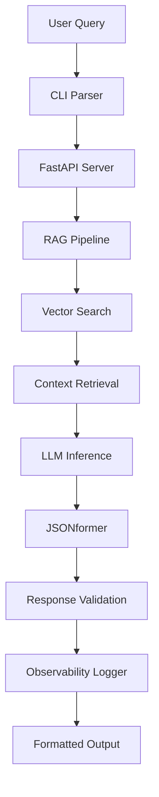
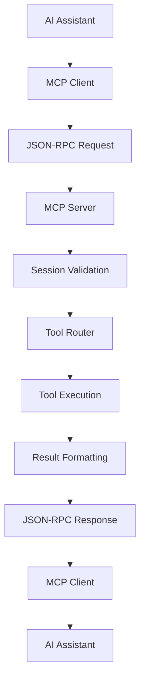

# SignalCLI Architecture

## System Overview

SignalCLI is built as a modular, microservices-oriented architecture with clear separation of concerns. The system includes a CLI interface, REST API server, MCP (Model Context Protocol) server, RAG pipeline, LLM inference engine, and comprehensive observability components.

## Architecture Diagram

```
┌─────────────────────────────────────────────────────────────────────────┐
│                          External Clients                                │
├─────────────┬─────────────┬─────────────┬────────────┬─────────────────┤
│   CLI Tool  │  REST API   │ MCP Clients │ WebSocket  │   AI Assistants │
└──────┬──────┴──────┬──────┴──────┬──────┴─────┬──────┴────────┬────────┘
       │             │             │            │               │
       ▼             ▼             ▼            ▼               ▼
┌─────────────────────────────────────────────────────────────────────────┐
│                         API Gateway Layer                                │
├─────────────┬──────────────────┬──────────────────┬────────────────────┤
│  CLI Client │  FastAPI Server  │   MCP Server     │  Streaming Handler  │
│   (Click)   │   (Port 8000)    │  (Port 8001)     │  (WebSocket/SSE)   │
└──────┬──────┴────────┬─────────┴────────┬─────────┴─────────┬──────────┘
       │               │                  │                   │
       ▼               ▼                  ▼                   ▼
┌─────────────────────────────────────────────────────────────────────────┐
│                      Application Layer                                   │
├──────────────┬──────────────┬──────────────┬──────────────┬────────────┤
│ RAG Pipeline │ Tool Registry│Context Router│ Permissions  │   Cache     │
└──────┬───────┴──────┬───────┴──────┬───────┴──────┬───────┴────┬───────┘
       │              │              │              │             │
       ▼              ▼              ▼              ▼             ▼
┌─────────────────────────────────────────────────────────────────────────┐
│                     Infrastructure Layer                                 │
├────────────┬────────────┬────────────┬────────────┬────────────────────┤
│ LLM Engine │Vector Store│ Embeddings │   Redis    │   Observability    │
│   (GGUF)   │ (Weaviate) │(Transformers)│  Cache   │(Prometheus/Grafana)│
└────────────┴────────────┴────────────┴────────────┴────────────────────┘
```

## Core Components

### 1. CLI Interface (`src/cli/`)
- **Purpose**: User-facing command-line interface
- **Technologies**: Click, Rich (for beautiful CLI output)
- **Responsibilities**:
  - Parse command-line arguments
  - Format and display responses
  - Handle user authentication
  - Provide progress indicators

```python
# Example CLI structure
@click.command()
@click.argument('query')
@click.option('--schema', help='JSON schema for structured output')
@click.option('--verbose', is_flag=True, help='Enable verbose logging')
def main(query: str, schema: Optional[str], verbose: bool):
    # CLI logic here
```

### 2. MCP Server (`src/mcp/`)
- **Purpose**: Model Context Protocol server for AI interoperability
- **Technologies**: FastAPI, WebSocket, JSON-RPC 2.0
- **Responsibilities**:
  - Protocol-compliant tool discovery
  - Session management
  - Request routing and execution
  - Streaming support

```python
# MCP server structure
class MCPServer:
    def __init__(self, tool_registry: ToolRegistry, router: ContextAwareRouter):
        self.tool_registry = tool_registry
        self.router = router
        self._sessions = {}
    
    async def handle_request(self, request: MCPRequest) -> MCPResponse:
        # Route to appropriate handler based on method
        if request.method == "initialize":
            return await self._handle_initialize(request)
        elif request.method == "tools/list":
            return await self._handle_tools_list(request)
        elif request.method == "tools/call":
            return await self._handle_tools_call(request)
```

### 3. RAG Pipeline (`src/application/rag/`)
- **Purpose**: Retrieval-augmented generation workflow
- **Technologies**: Weaviate, sentence-transformers, LangChain
- **Components**:
  - Document ingestion and chunking
  - Vector embedding generation
  - Similarity search and retrieval
  - Context preparation for LLM

```python
# RAG pipeline flow
class RAGPipeline:
    def __init__(self, vector_store: VectorStore, embedder: Embedder):
        self.vector_store = vector_store
        self.embedder = embedder
    
    def retrieve_and_generate(self, query: str) -> RAGResponse:
        # 1. Embed query
        # 2. Search vector store
        # 3. Prepare context
        # 4. Generate response
```

### 4. LLM Engine (`src/infrastructure/llm/`)
- **Purpose**: Local language model inference
- **Technologies**: llamafile, GGUF, transformers
- **Features**:
  - Model loading and management
  - Token streaming
  - JSON-constrained generation via JSONformer
  - GPU/CPU optimization

### 5. FastAPI Backend (`src/api/`)
- **Purpose**: HTTP API for programmatic access
- **Technologies**: FastAPI, Pydantic, uvicorn
- **Endpoints**:
  - `/query` - Main query processing
  - `/health` - Service health check
  - `/metrics` - Observability metrics
  - `/schema` - JSON schema validation

## Data Flow

### CLI Flow


### MCP Flow


## MCP Server Architecture

### Protocol Implementation
- **JSON-RPC 2.0**: Standard protocol for all communications
- **Session Management**: Stateful sessions with initialization
- **Tool Discovery**: Dynamic tool registration and capabilities
- **Error Handling**: Standard error codes and recovery

### Tool System
```python
# Tool interface
class Tool(ABC):
    @abstractmethod
    async def execute(self, params: Dict[str, Any], context: Dict[str, Any]) -> List[Dict[str, Any]]:
        """Execute tool and return MCP-compliant content array"""
        pass
```

### Context-Aware Routing
- **Capability Matching**: Route based on required capabilities
- **Semantic Similarity**: Use embeddings for intelligent routing
- **Load Balancing**: Distribute requests across tool instances
- **Cost Optimization**: Select tools based on resource usage
- **Adaptive Strategy**: Learn from usage patterns

## Vector Store Design

### Weaviate Schema

```json
{
  "class": "Document",
  "properties": [
    {
      "name": "content",
      "dataType": ["text"]
    },
    {
      "name": "source",
      "dataType": ["string"]
    },
    {
      "name": "chunk_id",
      "dataType": ["string"]
    },
    {
      "name": "metadata",
      "dataType": ["object"]
    }
  ],
  "vectorizer": "text2vec-transformers"
}
```

### Indexing Strategy
- **Chunking**: 512-token overlapping windows
- **Embedding**: all-MiniLM-L6-v2 model
- **Storage**: Persistent volumes for Docker deployment

## LLM Integration

### Model Support
- **Primary**: LLaMA 3.1 8B Instruct (GGUF)
- **Fallback**: OpenAI API (configurable)
- **Local**: llamafile for cross-platform support

### JSONformer Integration

```python
from jsonformer import Jsonformer

# Schema-constrained generation
schema = {
    "type": "object",
    "properties": {
        "answer": {"type": "string"},
        "confidence": {"type": "number"},
        "sources": {
            "type": "array",
            "items": {"type": "string"}
        }
    }
}

jsonformer = Jsonformer(model, tokenizer, schema, prompt)
result = jsonformer()
```

## Observability Architecture

### Metrics Collection
- **Token Usage**: Input/output token counts
- **Latency**: End-to-end response times
- **Error Rates**: Failure classification
- **Resource Usage**: Memory, CPU, GPU utilization

### Logging Strategy
```python
import structlog

logger = structlog.get_logger()

# Structured logging example
logger.info(
    "query_processed",
    query_id=query_id,
    tokens_used=tokens,
    latency_ms=latency,
    model_name=model,
    success=True
)
```

## Security Considerations

### Input Validation
- Query length limits (max 2048 characters)
- Schema validation for JSON requests
- Rate limiting per IP/user

### Data Privacy
- No persistent storage of user queries
- Optional query logging (disabled by default)
- Secure API key management

## Scalability Design

### Horizontal Scaling
- Stateless FastAPI servers
- Load balancer integration
- Shared vector store across instances

### Performance Optimization
- Response caching (Redis-compatible)
- Connection pooling
- Async request handling

## Deployment Architecture

### Docker Composition
```yaml
services:
  # Infrastructure
  weaviate:
    image: semitechnologies/weaviate:1.22.4
    ports:
      - "8080:8080"
  
  redis:
    image: redis:7-alpine
    ports:
      - "6379:6379"
    
  # API Servers
  signalcli-api:
    build: .
    ports:
      - "8000:8000"
    depends_on:
      - weaviate
      - redis
    
  signalcli-mcp:
    build:
      dockerfile: docker/Dockerfile.mcp
    ports:
      - "8001:8001"
    depends_on:
      - weaviate
      - redis
    
  # CLI
  signalcli-cli:
    build: .
    command: ["python", "src/cli/main.py"]
    depends_on:
      - signalcli-api
```

### Kubernetes Support
- Helm charts for production deployment
- ConfigMaps for environment-specific settings
- PersistentVolumes for model storage

## Configuration Management

### Environment Variables
```bash
# LLM Configuration
SIGNALCLI_MODEL_PATH=/models/llama-3.1-8b.gguf
SIGNALCLI_MAX_TOKENS=2048
SIGNALCLI_TEMPERATURE=0.7

# Vector Store
WEAVIATE_HOST=localhost
WEAVIATE_PORT=8080

# API
API_HOST=0.0.0.0
API_PORT=8000
API_WORKERS=4

# MCP Server
MCP_HOST=0.0.0.0
MCP_PORT=8001
MCP_WORKERS=4
MCP_CACHE_SIZE_MB=1024

# Cache
REDIS_URL=redis://localhost:6379
CACHE_PROVIDER=redis
```

### Configuration Files
- `config/settings.yaml` - Main configuration
- `config/schemas/` - JSON schemas directory
- `config/logging.yaml` - Logging configuration

## Testing Strategy

### Unit Tests
- Individual component testing
- Mock external dependencies
- Schema validation testing

### Integration Tests
- End-to-end pipeline testing
- Vector store integration
- API endpoint testing

### Performance Tests
- Load testing with locust
- Memory profiling
- Latency benchmarking

## Scaling and Performance

### Horizontal Scaling
- **API Servers**: Multiple instances behind load balancer
- **MCP Server**: WebSocket-aware load balancing
- **Vector Store**: Weaviate cluster with sharding
- **Cache**: Redis cluster for distributed caching

### Performance Optimizations
- **Connection Pooling**: Reuse database connections
- **Request Batching**: Group similar requests
- **Async Processing**: Non-blocking I/O throughout
- **Resource Limits**: CPU/memory constraints per container

## Security Architecture

### Authentication & Authorization
- **API Keys**: For REST API access
- **MCP Sessions**: Initialized sessions for tool access
- **Rate Limiting**: Token bucket algorithm
- **RBAC**: Role-based access control for tools

### Data Security
- **Encryption**: TLS for all external communications
- **Input Validation**: Schema validation on all inputs
- **Audit Logging**: Complete operation history
- **Secrets Management**: Environment variables and key vaults

## Future Enhancements

### Planned Features
- Multi-model support (Mistral, CodeLlama, GPT-4)
- Advanced RAG techniques (HyDE, CoT, Multi-hop)
- GraphQL API alongside REST
- Plugin system for custom MCP tools
- Federated MCP servers

### Optimization Roadmap
- GPU inference acceleration with CUDA
- Model quantization (INT8/INT4) support
- Enhanced streaming with backpressure
- Distributed vector search with Faiss
- Edge deployment capabilities