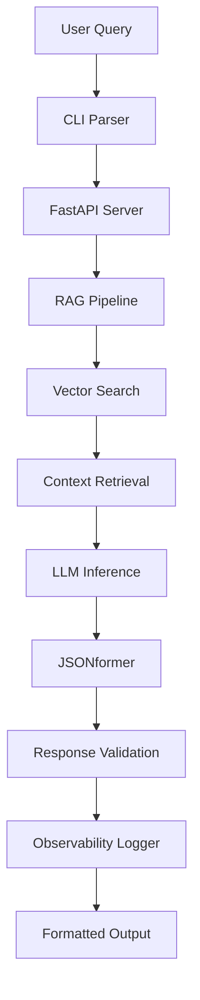

# SignalCLI Architecture

## System Overview

SignalCLI is built as a microservices architecture with clear separation of concerns between the CLI interface, RAG pipeline, LLM inference, and observability components.

## Core Components

### 1. CLI Interface (`src/cli/`)
- **Purpose**: User-facing command-line interface
- **Technologies**: Click, Rich (for beautiful CLI output)
- **Responsibilities**:
  - Parse command-line arguments
  - Format and display responses
  - Handle user authentication
  - Provide progress indicators

```python
# Example CLI structure
@click.command()
@click.argument('query')
@click.option('--schema', help='JSON schema for structured output')
@click.option('--verbose', is_flag=True, help='Enable verbose logging')
def main(query: str, schema: Optional[str], verbose: bool):
    # CLI logic here
```

### 2. RAG Pipeline (`src/rag/`)
- **Purpose**: Retrieval-augmented generation workflow
- **Technologies**: Weaviate, sentence-transformers, LangChain
- **Components**:
  - Document ingestion and chunking
  - Vector embedding generation
  - Similarity search and retrieval
  - Context preparation for LLM

```python
# RAG pipeline flow
class RAGPipeline:
    def __init__(self, vector_store: VectorStore, embedder: Embedder):
        self.vector_store = vector_store
        self.embedder = embedder
    
    def retrieve_and_generate(self, query: str) -> RAGResponse:
        # 1. Embed query
        # 2. Search vector store
        # 3. Prepare context
        # 4. Generate response
```

### 3. LLM Engine (`src/llm/`)
- **Purpose**: Local language model inference
- **Technologies**: llamafile, GGUF, transformers
- **Features**:
  - Model loading and management
  - Token streaming
  - JSON-constrained generation via JSONformer
  - GPU/CPU optimization

### 4. FastAPI Backend (`src/api/`)
- **Purpose**: HTTP API for programmatic access
- **Technologies**: FastAPI, Pydantic, uvicorn
- **Endpoints**:
  - `/query` - Main query processing
  - `/health` - Service health check
  - `/metrics` - Observability metrics
  - `/schema` - JSON schema validation

## Data Flow



## Vector Store Design

### Weaviate Schema

```json
{
  "class": "Document",
  "properties": [
    {
      "name": "content",
      "dataType": ["text"]
    },
    {
      "name": "source",
      "dataType": ["string"]
    },
    {
      "name": "chunk_id",
      "dataType": ["string"]
    },
    {
      "name": "metadata",
      "dataType": ["object"]
    }
  ],
  "vectorizer": "text2vec-transformers"
}
```

### Indexing Strategy
- **Chunking**: 512-token overlapping windows
- **Embedding**: all-MiniLM-L6-v2 model
- **Storage**: Persistent volumes for Docker deployment

## LLM Integration

### Model Support
- **Primary**: LLaMA 3.1 8B Instruct (GGUF)
- **Fallback**: OpenAI API (configurable)
- **Local**: llamafile for cross-platform support

### JSONformer Integration

```python
from jsonformer import Jsonformer

# Schema-constrained generation
schema = {
    "type": "object",
    "properties": {
        "answer": {"type": "string"},
        "confidence": {"type": "number"},
        "sources": {
            "type": "array",
            "items": {"type": "string"}
        }
    }
}

jsonformer = Jsonformer(model, tokenizer, schema, prompt)
result = jsonformer()
```

## Observability Architecture

### Metrics Collection
- **Token Usage**: Input/output token counts
- **Latency**: End-to-end response times
- **Error Rates**: Failure classification
- **Resource Usage**: Memory, CPU, GPU utilization

### Logging Strategy
```python
import structlog

logger = structlog.get_logger()

# Structured logging example
logger.info(
    "query_processed",
    query_id=query_id,
    tokens_used=tokens,
    latency_ms=latency,
    model_name=model,
    success=True
)
```

## Security Considerations

### Input Validation
- Query length limits (max 2048 characters)
- Schema validation for JSON requests
- Rate limiting per IP/user

### Data Privacy
- No persistent storage of user queries
- Optional query logging (disabled by default)
- Secure API key management

## Scalability Design

### Horizontal Scaling
- Stateless FastAPI servers
- Load balancer integration
- Shared vector store across instances

### Performance Optimization
- Response caching (Redis-compatible)
- Connection pooling
- Async request handling

## Deployment Architecture

### Docker Composition
```yaml
services:
  weaviate:
    image: semitechnologies/weaviate:1.22.4
    ports:
      - "8080:8080"
    
  signalcli-api:
    build: .
    ports:
      - "8000:8000"
    depends_on:
      - weaviate
    
  signalcli-cli:
    build: .
    command: ["python", "src/cli/main.py"]
    depends_on:
      - signalcli-api
```

### Kubernetes Support
- Helm charts for production deployment
- ConfigMaps for environment-specific settings
- PersistentVolumes for model storage

## Configuration Management

### Environment Variables
```bash
# LLM Configuration
SIGNALCLI_MODEL_PATH=/models/llama-3.1-8b.gguf
SIGNALCLI_MAX_TOKENS=2048
SIGNALCLI_TEMPERATURE=0.7

# Vector Store
WEAVIATE_HOST=localhost
WEAVIATE_PORT=8080

# API
API_HOST=0.0.0.0
API_PORT=8000
API_WORKERS=4
```

### Configuration Files
- `config/settings.yaml` - Main configuration
- `config/schemas/` - JSON schemas directory
- `config/logging.yaml` - Logging configuration

## Testing Strategy

### Unit Tests
- Individual component testing
- Mock external dependencies
- Schema validation testing

### Integration Tests
- End-to-end pipeline testing
- Vector store integration
- API endpoint testing

### Performance Tests
- Load testing with locust
- Memory profiling
- Latency benchmarking

## Future Enhancements

### Planned Features
- Multi-model support (Mistral, CodeLlama)
- Advanced RAG techniques (HyDE, CoT)
- Web interface dashboard
- Plugin system for custom processors

### Optimization Roadmap
- GPU inference acceleration
- Model quantization (INT8/INT4)
- Streaming response support
- Distributed vector search